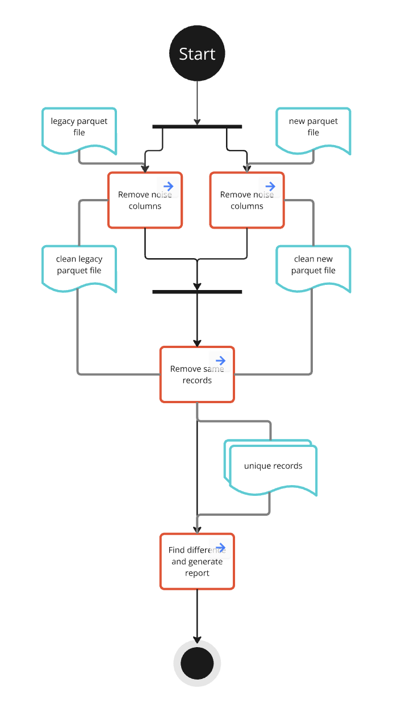
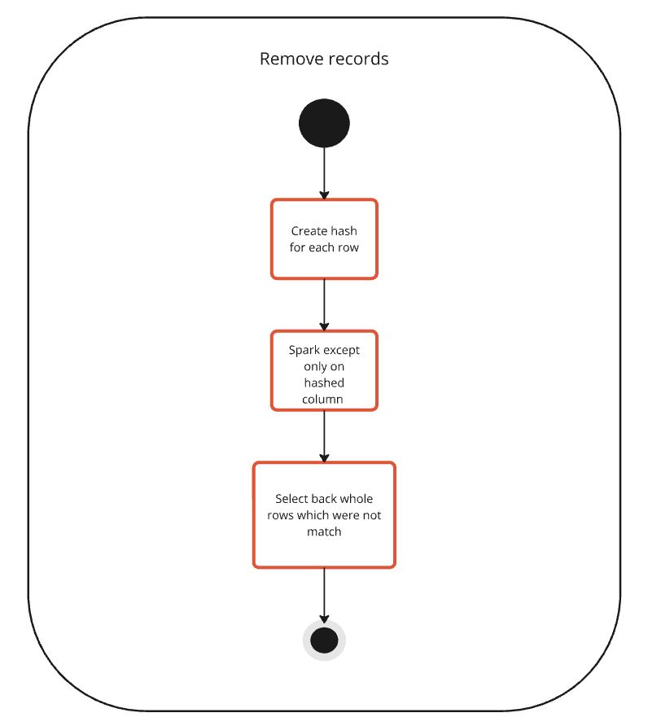
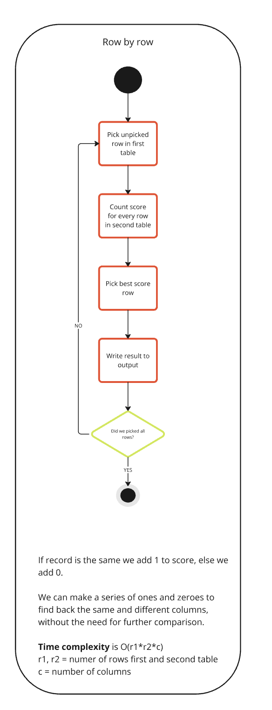

# CPS-Dataset-Comparison
Tool for exact comparison two Parquet files.
<!-- toc -->
- [What is CPS-Dataset-Comparison?](#what-is-CPS-Dataset-Comparison)
    - [Removing noise](#removing-noise)
    - [Removing same recors](#removing-same-recors)
    - [Detailed Analyses](#detailed-analyses)
- [Building the project](#building-the-project)
- [How to run](#how-to-run)
    - [Requirements](#requirements)
- [How to run tests](#how-to-run-tests)
<!-- tocstop -->

## What is CPS Dataset Comparison?
There was a need for a comparison tool that could help when we want to migrate from the legacy system to the new one, moving from Crunch implementation to Spark. The comparison tool should compare both outputs from a new and legacy system to check that changes did not effect the behavior and results.

In this particular solution, we will consider Parquet files as input. The tool will first find rows that are present in only one table. Then it will focus on detailed analyses of differences between samples. You can see the flow in the following chart:

### Removing noise
Noise removal will not be implemented in the first version. It was decided that this could be implemented afterward if there was a problem with noise columns. But we know some noise columns: Timestamps and Run id.
The approach for finding nondeterministic columns (noise columns) will be: Finding which columns are not the same in two Crunch runs (every run is constructed from 2 Crunch runs and one Spark run).
> At first we should compare the schema of both parquet files

### Removing same recors 
We have decided not to bother with duplicates so we will remove common rows as described on the following flow chart:

For *hash* we can use: [FNV](https://en.wikipedia.org/wiki/Fowler–Noll–Vo_hash_function), 
[CRC-64-ISO](https://en.wikipedia.org/wiki/Cyclic_redundancy_check), 
[data-hash-tool](https://github.com/AbsaOSS/data-hash-tool) (PoC)

### Detailed analyses
We have decided to use row by row comparison for detailed analyses. We can use more advanced heuristics in the future if this approach does not suit us. You can see the approach on the flowing chart.

> All charts could be seen on [this Miro board](https://miro.com/app/board/uXjVLaOagec=/?share_link_id=579669188211)
## Building the project
## How to run
### Requirements
- scala 2.12
- spark 3.4
- java 17
## How to run tests

| sbt command | test type | info |
| ----------- | --------- | ---- |
| `sbt test`  | ...       | ...  |