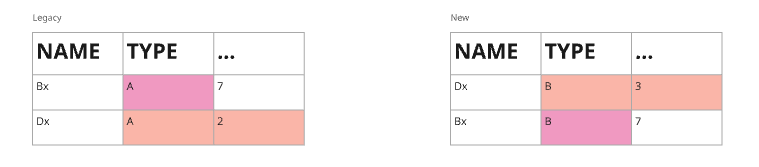

# CPS-Dataset-Comparison

Tool for exact comparison two Parquet files.

<!-- toc -->
- [What is CPS-Dataset-Comparison?](#what-is-CPS-Dataset-Comparison)
    - [Abstract example](#abstract-example)
    - [Removing noise](#removing-noise)
    - [Removing same records](#removing-same-records)
    - [Detailed Analyses](#detailed-analyses)
- [Project structure](#project-structure)
    - [bigfiles](#bigfiles)
    - [smallfiles](#smallfiles)
<!-- tocstop -->

## What is CPS Dataset Comparison?

There was a need for a comparison tool that could help when we want to migrate from the legacy system to the new one, moving from Crunch implementation to Spark. The comparison tool should compare both outputs from a new and legacy system to check that changes did not effect the behavior and results.

In this particular solution, we will consider Parquet files as input. The tool will first find rows that are present in only one table. Then it will focus on detailed analyses of differences between samples. You can see the flow in the following chart:

### Abstract example

Let's say we have two Parquet files with the following content:

Firstly we will remove the first column because it is always different/autogenerated ...

We can see that the first file has 1st and 3rd rows exactly the same as the 2nd and 3rd in second file. So we will remove them.

Then we can found the difference between other rows.

### Removing noise

Noise removal will not be implemented in the first version. It was decided that this could be implemented afterward if there was a problem with noise columns. But we know some noise columns: Timestamps and Run id.
The approach for finding nondeterministic columns (noise columns) will be: Finding which columns are not the same in two Crunch runs (every run is constructed from 2 Crunch runs and one Spark run).

> At first we should compare the schema of both parquet files

### Removing same records

We have decided not to bother with duplicates so we will remove common rows as described on the following flow chart:

For *hash* we can use: [FNV](https://en.wikipedia.org/wiki/Fowler–Noll–Vo_hash_function), 
[CRC-64-ISO](https://en.wikipedia.org/wiki/Cyclic_redundancy_check), 
[data-hash-tool](https://github.com/AbsaOSS/data-hash-tool) (PoC)

### Detailed analyses

We have decided to use row by row comparison for detailed analyses. We can use more advanced heuristics in the future if this approach does not suit us. You can see the approach on the flowing chart.

## Project structure

Project is divided into two modules:

### bigfiles

- bigfile is file that does not fit to RAM
- module for comparing big files
- written in Scala
- more about bigfiles module could be found in [bigfiles README](bigfiles/README.md)

### smallfiles

- smallfile is file that fits to RAM
- module for comparing small files
- written in Python
- more about smallfiles module could be found in [smallfiles README](smallfiles/README.md)
