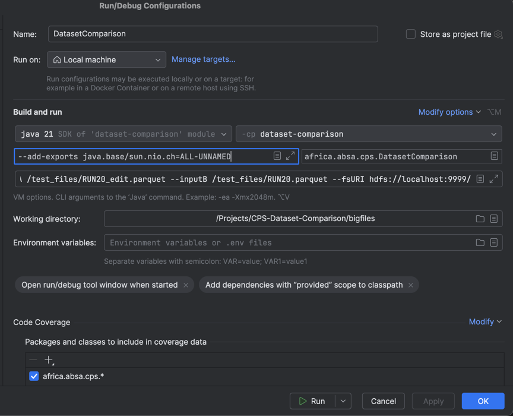

# Scala CPS-Dataset-Comparison 

This is scala implementation of the project. It is used for comparing big files.

- [How to run](#how-to-run)
  - [Requirements](#requirements)
  - [Switch to specific SDK](#switch-to-specific-sdk)
- [How to run tests](#how-to-run-tests)

## How to run

First run assembly: `sbt assembly`

Then run:

```bash
spark-submit target/scala-2.12/dataset-comparison-assembly-1.0.jar -o <output-path> --inputA <A-file-path> --inputB <B-file-path>
```

### Run with specific config 

```bash
spark-submit --class africa.absa.cps.DatasetComparison --conf "spark.driver.extraJavaOptions=-Dconfig.file=/path/to/application.conf" target/scala-2.12/dataset-comparison-assembly-0.1.0.jar -o <output-path> --inputA <A-file-path> --inputB <B-file-path> -d Row
```
`-d Row` is optional parameter for detailed analyses that specifies which analyses to use. Now it can be only `Row`.
It will compute detailed analyses if number of different columns is less than 200, you can change this threshold in `src/main/resources/application.conf`.
### Spark configuration
you can set spark configuration in `spark-defaults.conf` file it is stored in `$SPARK_HOME/conf` directory
You will found there `spark-defaults.conf.template` remove `.template` from the file name and set your configuration there.
It could look like this:

```bash
spark.hadoop.fs.default.name       hdfs://localhost:9999/ # set your hdfs uri
spark.hadoop.fs.defaultFS          hdfs://localhost:9999/ # set your hdfs uri

```

### Requirements

- scala 2.12
- spark 3.5.1
- java 11.0.24-amzn

more requirements are in [Dependency](project/Dependencies.scala) file

### Switch to specific SDK
You can use following command to switch to
the configuration present in `.sdkmanrc` file.
```bash 
sdk env
```
To switch back run following command:
```bash
sdk env clear
```
If you don't have some version installed you can
install them all by running following command:
```bash
sdk env install
```

## How to run tests


| sbt command | test type | info                                   |
| ----------- |-----------|----------------------------------------|
| `sbt test`  | ...       | It will run tests in test/scala folder |


---------

## Installing hadoop

tutorial [here](https://dev.to/awwsmm/installing-and-running-hadoop-and-spark-on-ubuntu-18-393h) 
1. sdk install hadoop
2. ``$ echo "export PATH=\$PATH:\$HADOOP_HOME/bin:\$HADOOP_HOME/sbin" >> ~/.bashrc``
3. configure files core-site.xml, hdfs-site.xml, mapred-site.xml, yarn-site.xml in /Users/<username>/.sdkman/candidates/hadoop/3.3.5/etc
     ```
      code core-site.xml          
      code hdfs-site.xml             
      code mapred-site.xml             
      code yarn-site.xml
    ```
   Add this into **hdfs-site.xml** between <configuration> tags
   ```xml
    <property>
      <name>dfs.name.dir</name>
      <value>/Users/AB032MJ/hadoop_temp/name_node</value> 
    </property>
    <property> 
      <name>dfs.data.dir</name>
      <value>/Users/AB032MJ/hadoop_temp/data_node</value> 
    </property>
    
    <property> 
      <name>hadoop.tmp.dir</name>
      <value>/Users/AB032MJ/hadoop_temp/internal_temp</value>  
    </property>
    
    <property>
      <name>dfs.namenode.logging.level</name>
      <value>all</value>
    </property>
    
    <property>
      <name>dfs.permissions</name>
      <value>false</value>
    </property>
    ```
    Add this into **core-site.xml** between <configuration> tags
    ```xml
       <property>
          <name>fs.defaultFS</name>
          <value>hdfs://localhost:9999</value>
       </property>
   ```
   
    Add this into **mapred-site.xml** between <configuration> tags
    ```xml
     <property>
        <name>mapreduce.framework.name</name>
        <value>yarn</value>
     </property>
     ```
    Add this into **yarn-site.xml** between <configuration> tags
    ```xml
       <property>
          <name>yarn.nodemanager.aux-services</name>
          <value>mapreduce_shuffle</value>
       </property>
       <property>
          <name>yarn.nodemanager.auxservices.mapreduce.shuffle.class</name>  
          <value>org.apache.hadoop.mapred.ShuffleHandler</value>
       </property>
    ```
   Add this into **hadoop-env.sh**
   ```export JAVA_HOME="/Users/AB032MJ/.sdkman/candidates/java/8.0.422-amzn"```

4. create directories by configuration for example: 
    ```
    sudo mkdir -p /opt/hadoop_tmp/hdfs/datanode
    sudo mkdir -p /opt/hadoop_tmp/hdfs/namenode
    sudo chown -R username /opt/hadoop_tmp
    ```
5. generate keys `ssh-keygen`
6. copy keys to authorized_keys `cat ~/.ssh/id_ed25519.pub >> ~/.ssh/authorized_keys`
7. copy keys into ssh localhost `ssh-copy-id username@localhost`
8. test ssh ` ssh <username>@localhost`
8. format namenode `hdfs namenode -format -force` (or `hadoop namenode -format`)
9. start hadoop `start-dfs.sh && start-yarn.sh`
10. add files to hdfs `hdfs dfs -put /path/to/file /path/to/hdfs`
11. stop hdfs `stop-dfs.sh && stop-yarn.sh`

if something goes wrong check logs in /Users/<username>/.sdkman/candidates/hadoop/3.3.5/logs

ResourceManager web running on http://localhost:8088/cluster
hdfs running on port 9999
NameNode web interface http://localhost:9870/ 

And you have to set remote login on:


running with hadoop:
```bash
sbt assembly
spark-submit target/scala-2.12/dataset-comparison-assembly-0.1.0.jar -o <output-path> --inputA <A-file-path> --inputB <B-file-path>  --fsURI http://localhost:9999/ 
```
` spark-submit target/scala-2.12/dataset-comparison-assembly-0.1.0.jar -o /test_files/output --inputA /test_files/RUN20_edit.parquet --inputB /test_files/RUN20.parquet --fsURI hdfs://localhost:9999/`
or you can uncomment code at the start of validate part in ArgsParserTest and change
FS to HDFS_URI and then run `sbt test`

### Setting up IntelliJ IDEA


